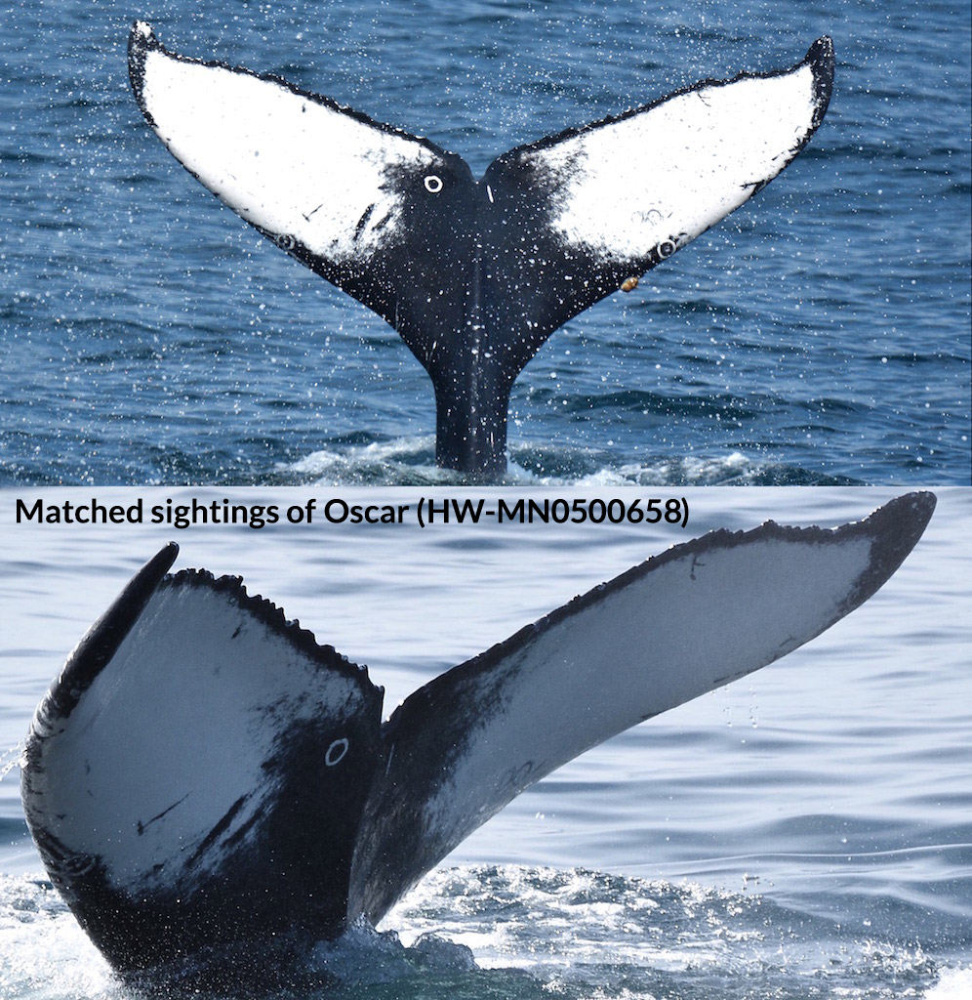
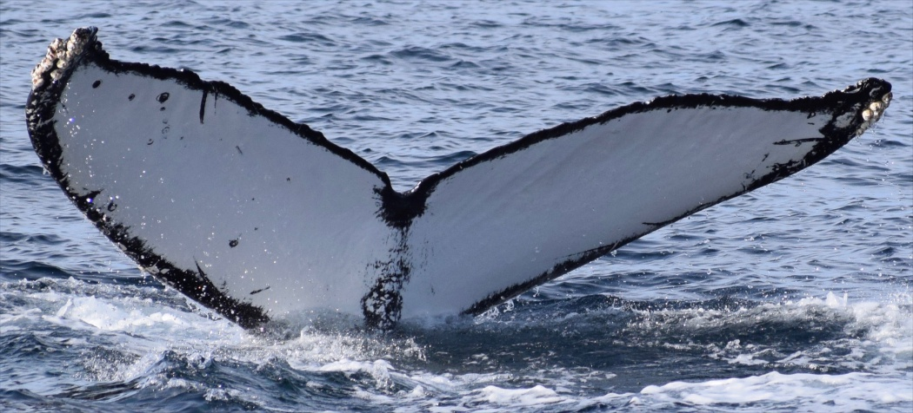
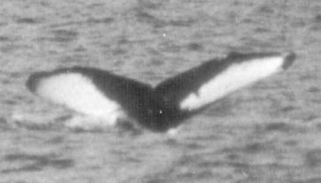
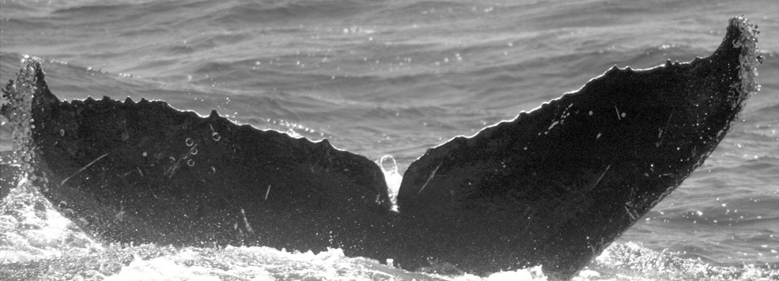
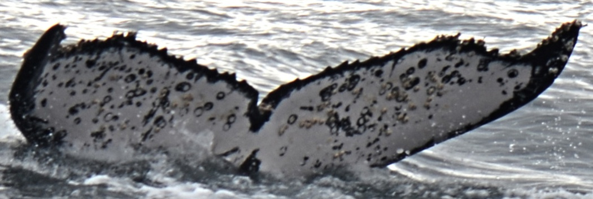

# Humpback whale identification

The challenge if you choose to accept it, within Happywhale database of 25000 images of whale flukes,
identify the 3000+ whales that appear 1, 2 or 3 times.

For example here are 2 different images with the same whale

And here is a sample of 10 whale's flukes we had to work with

## What you will find here

Disclaimer, the code is a baseline setup code with a low mAP@5 score of 0.30.

This is an example of how to use [Nvidia DALI](https://github.com/NVIDIA/DALI) for pure GPU data augmentation and [Nvidia APEx](https://github.com/NVIDIA/apex) for multi-precision training (FP16+FP32) on a 2x2080Ti setup with PyTorch `DataParallel`. (Note: Nvidia deprecated the APEx API I was using, replacement is straightforward)

Versions (version.release.commithash):
  - PyTorch - v1.0rc0.r2098.gded4ff87af
  - Nvidia DALI - v0.7.0.dev.r64.gd2bcc4a8
  - Nvidia APEx - r226.3c7a0e4

For Archlinux users, PKGBUILDs of my data science environment are available in my [Data Science repo](https://github.com/mratsim/Arch-Data-Science/tree/8d398b2aea2114a039b286a4c194d967ca01af6f).

This setup avoids being bottlenecked on CPU data augmentation in many cases when using "simple" networks like ResNet50.

Furthermore, you will find an pure PyTorch to FastAI and Leslie Smith super-convergence and learning rate finder. FastAI is a tremendous effort to make deep learning best practice at your fingertips, however you lose some flexibility on models, logging and other utilities that would be useful in a competitive or production setup.

Lastly but not least, you will find several papers on identification tasks (commonly called Re-Id) which goes into deep details into various techniques for similarity learning like Siamese networks, Triplet Loss, re-identification networks, figure-of-merit learning.

Bonus: I'm pretty confident I've implemented the fastest mAP@5 function in Python + Deep Learning library.

## Papers

### Neural Network Architectures

- Learning similarity, Metric learning, Low-shot learning, One-shot learning:
    - Siamese Networks: https://www.cs.cmu.edu/~rsalakhu/papers/oneshot1.pdf
    - Generative Adversarial Network
    - Triplet network
      - https://omoindrot.github.io/triplet-loss
      - Deep Metric Learning using Triplet Network: https://arxiv.org/abs/1412.6622
      - Deep Triplet Ranking Networks for One-Shot Recognition: https://arxiv.org/abs/1804.07275v1
      - http://openaccess.thecvf.com/content_ICCV_2017_workshops/papers/w6/Liao_Triplet-Based_Deep_Similarity_ICCV_2017_paper.pdf
      - In Defense of the Triplet Loss for Person Re-Identification - https://arxiv.org/pdf/1703.07737
      - Quadruplet Loss: https://arxiv.org/abs/1704.01719
      - Histogram Loss: https://arxiv.org/abs/1611.00822
- Matching network: https://arxiv.org/abs/1606.04080
- Re-Identification networks
  - https://github.com/KaiyangZhou/deep-person-reid and https://github.com/KaiyangZhou/deep-person-reid/blob/master/AWESOME_REID.md
  - Dolphin ReID with metric embedded learning: https://arxiv.org/abs/1901.03662
- Meta learning: https://openreview.net/pdf?id=rJY0-Kcll
- Neural Turing Machine
      - https://arxiv.org/pdf/1410.5401
      - One shot learning: https://arxiv.org/abs/1605.06065
- Unsupervised pretraining: http://www.jmlr.org/papers/volume11/erhan10a/erhan10a.pdf
  - Pretraining with an autoencoder
  - Not gradient based
    - Restricted Boltzmann machine & Deep Belief Network
    - Conditional Random Field
- Multi stage with a segmentation/Region Proposal network and then a predictor on the crops

- Training from Scratch: https://arxiv.org/pdf/1811.08883.pdf

### Loss function and optimizing directly for mAP

- Can we do a differentiable Map@5?
- Optimisation and Operations Research techniques
  https://pdfs.semanticscholar.org/769b/67b5e953966524bdcbec657a0e44bdc62cba.pdf
  - Linear Assignment Problem
  - Nonsmooth optimization:
    - Bundle method
    - Stochastic Gradient Descent
    - Constrained Quadratic Programming
  - SmoothGrad method
  > The rationale is to compare our upper bound with an
  > approximation of the ranking score to assess whether
  > the approximation provides any benefit.  The basic idea is to perform a direct gradient
  > descent optimization on a smoothed version of the NDCG measure
- Scalable Learning of Non-Decomposable Objectives: https://arxiv.org/pdf/1608.04802.pdf
- An Efficient Gradient-based Approach to Optimizing Average Precision Through Maximal Figure-of-Merit Learning:
  https://www.researchgate.net/publication/257672531_An_Efficient_Gradient-based_Approach_to_Optimizing_Average_Precision_Through_Maximal_Figure-of-Merit_Learning (Paywalled ....)
- A Maximal Figure-of-Merit Learning Approach to Maximizing Mean Average Precision with Deep Neural Network Based Classifiers
  http://www.mirlab.org/conference_papers/international_conference/ICASSP%202014/papers/p4536-li.pdf

### Learning rate and super-convergence

  - One-cycle Policy: https://arxiv.org/abs/1506.01186
  - Super convergence: https://arxiv.org/pdf/1708.07120.pdf and https://github.com/lnsmith54/super-convergence
  - SGDR Stochastic gradient descent with restart: sudden increase of LR to hop out of local minima
    https://arxiv.org/pdf/1608.03983.pdf