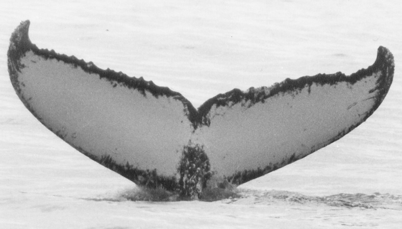

# Humpback whale identification

The challenge if you choose to accept it, within Happywhale database of 25000 images of whale flukes,
identify the 3000+ whales that appear 1, 2 or 3 times.

For example here are 2 different images with the same whale

And here is a sample of 10 whale's flukes we had to work with

